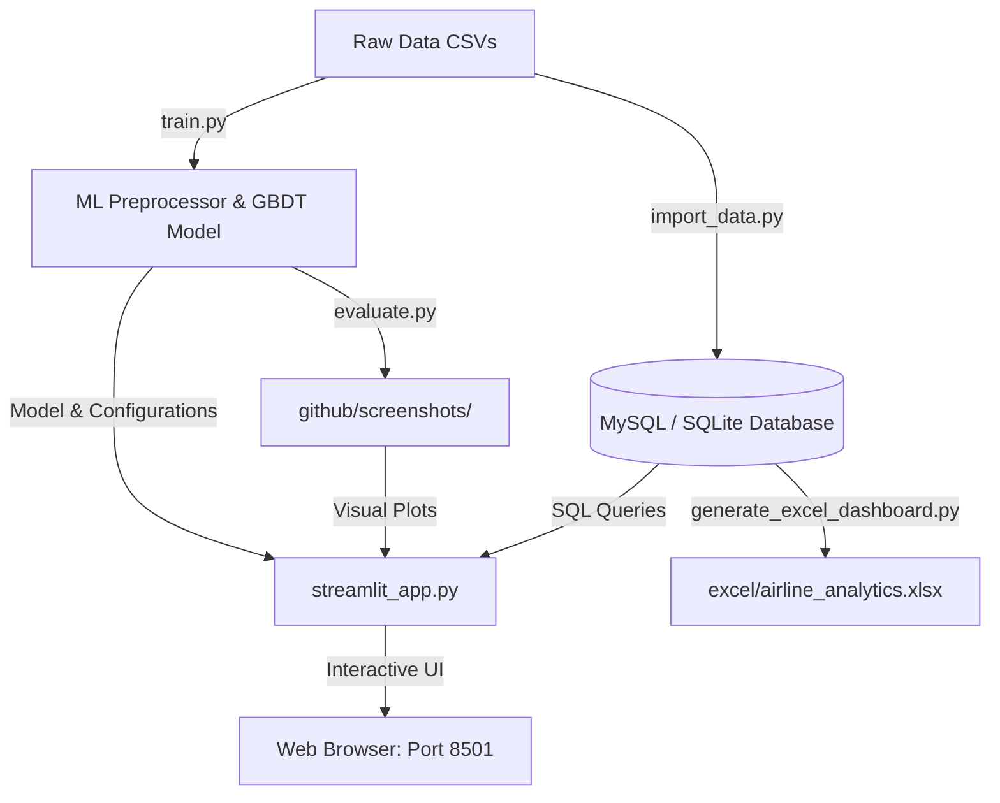

# ✈️ Airline Flight Delay & Cancellation Analytics Platform

An end-to-end data analytics and predictive modeling platform designed to help airline managers and operations directors monitor reliability, identify airport bottlenecks, and predict flight delays before departure.

---

## 💼 Business Problem & Project Goal

Flight delays and cancellations cost the global aviation industry billions of dollars annually in passenger compensations, crew overtime, and repositioning expenses. 

**This platform addresses these operational challenges by:**
1. **Monitoring Operational KPIs:** Tracking on-time performance (OTP), cancellation rates, and average delay minutes.
2. **Predicting Delay Risk:** Empowering managers to input scheduled flight details (carrier, origin, weather, departure slot) and get a machine-learning-based delay probability risk before departure.
3. **Data-Driven Audits:** Providing an interactive SQL console and a pre-formatted financial Excel dashboard to audit operational inefficiencies.

---

## 🗺️ System Architecture

---

## 🛠️ Technology Stack & Project Components

* **Frontend & Interactive UI:** `Streamlit`, `Altair` (for dynamic, interactive dashboards)
* **Database & Ingestion (ETL):** `SQLAlchemy`, `PyMySQL`, `SQLite`, `Pandas` (MySQL Star Schema setup)
* **Machine Learning Pipeline:** `scikit-learn` (HistGradientBoosting Classifier), `joblib`
* **Automated Excel Reporting:** `openpyxl` (pivots, native Excel bar/line charts, and conditional formatting)
* **Power BI Design Blueprint:** DAX Measures and Star-Schema configuration spec

---

## 🚀 Key Modules & What They Do

### 1. 📊 Executive KPI Dashboard
* **Dynamic Analytics:** Displays flight metrics like Total Flights, On-Time Performance (OTP %), and Cancellation Rate.
* **Granular Visuals:** Generates interactive carrier-wise and hour-wise delay charts using Altair.

### 2. 🔮 Pre-Departure Delay Predictor
* **ML Model:** A fast Gradient Boosted Decision Tree (GBDT) trained on **200,000 operations**.
* **Risk Factors:** Categorizes risk factors (Airport Delays, Time Slot Congestion, Airline Reliability, Day of Week Pattern) and visualizes how they contribute to the final probability against global averages.

### 3. 💻 SQL Query Console
* **Direct Database Audits:** Allows operations analysts to run custom SQL queries against the live database directly from the browser window.
* **Templates Included:** Includes quick-select queries to find the most delayed airports, airline cancellation rates, and weather impacts.

### 4. 📈 Automated Excel Visual Dashboard
* **Automated Reporting:** Python script pulls data from the live database and builds a styled spreadsheet (`excel/airline_analytics.xlsx`).
* Includes pre-calculated pivot tables, summary logs, and actual native Excel charts ready for executive presentations.

---

## 📈 Machine Learning Validation & Results

The classifier predicts whether a flight will experience a departure delay of **15 minutes or more (DEP_DEL15)**. During evaluation, the model achieved a **ROC-AUC score of 0.69**:

| Metric | Chart Visual | Business Translation |
| --- | --- | --- |
| **Feature Importance** |  | Highlights that **historical carrier delay rates** and **departure time blocks** are the strongest predictors of delay risk. |
| **ROC & Precision-Recall** |  | Demonstrates strong predictive capacity to separate delayed flights from scheduled on-time flights under class imbalance. |
| **Confusion Matrix** |  | Allows operations teams to trade off between flagging true delay risks vs. minimizing false alarms. |

---

## 📊 Key Operational Insights Discovered

1. **Carrier Bottlenecks:** Certain carriers (e.g., ExpressJet `EV`) display historical delay rates over **26%**, whereas others (e.g., Hawaiian `HA`) average under **10%**.
2. **Time Slot Congestion:** Flight delay probability increases steadily throughout the day, peaking between **6 PM – 9 PM** due to systemic schedule build-up.
3. **Weather Sensitivity:** Wind speed (`AWND`) and precipitation (`PRCP`) display a direct positive correlation with average delay times, indicating that airport infrastructure remains weather-sensitive.

---

## 📂 Codebase Directory Layout

* 🗄️ [**`sql_database/`**](file:///c:/Users/ntanu/OneDrive/Desktop/Airline%20Flight%20Delay%20&%20Cancellation%20Analytics%20Platform/sql_database): MySQL/SQLite schemas and the ETL database importer pipeline.
* 📊 [**`excel/`**](file:///c:/Users/ntanu/OneDrive/Desktop/Airline%20Flight%20Delay%20&%20Cancellation%20Analytics%20Platform/excel): Python code that generates the executive Excel dashboard and the output spreadsheet.
* 🐍 [**`python/`**](file:///c:/Users/ntanu/OneDrive/Desktop/Airline%20Flight%20Delay%20&%20Cancellation%20Analytics%20Platform/python): Explanatory notebooks, pipeline features, training logic, and model evaluations.
* 🖥️ [**`power_bi/`**](file:///c:/Users/ntanu/OneDrive/Desktop/Airline%20Flight%20Delay%20&%20Cancellation%20Analytics%20Platform/power_bi): Specifications and DAX formulations for building a Power BI dashboard.
* 🌐 [**`streamlit_app.py`**](file:///c:/Users/ntanu/OneDrive/Desktop/Airline%20Flight%20Delay%20&%20Cancellation%20Analytics%20Platform/streamlit_app.py): The main Streamlit web application script.
