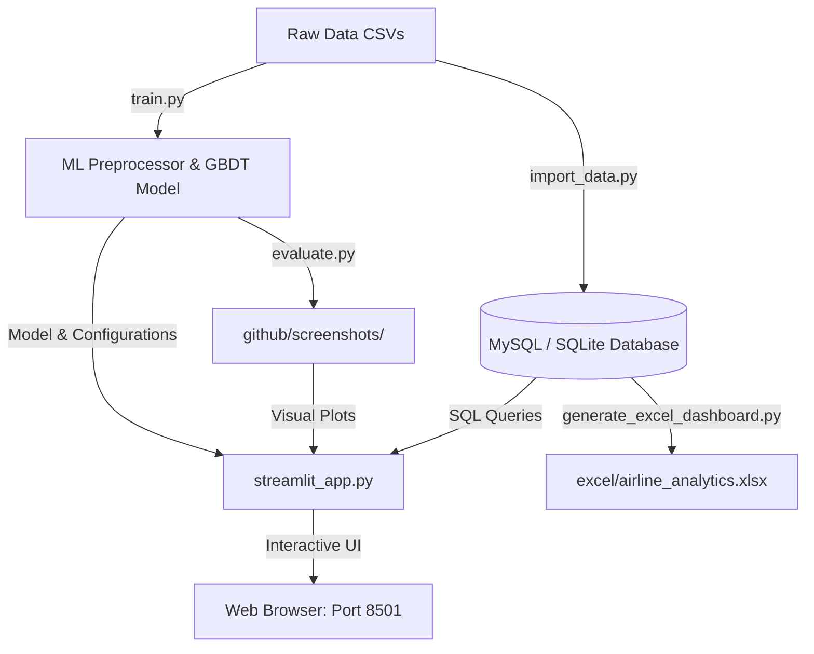
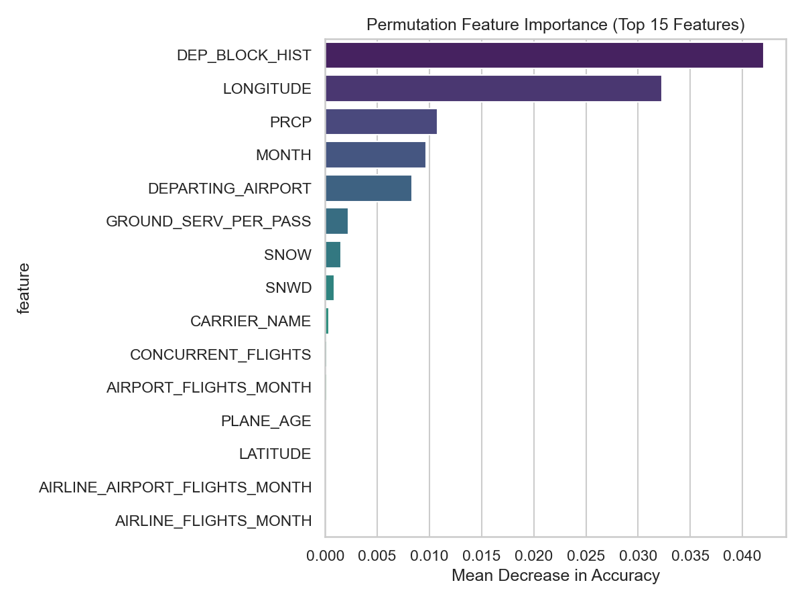
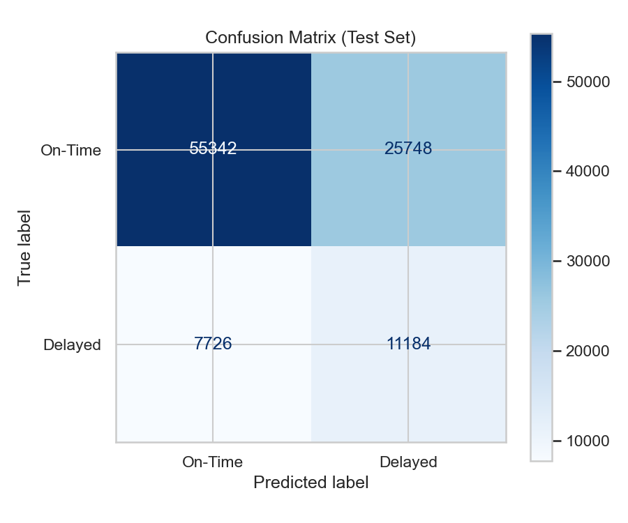
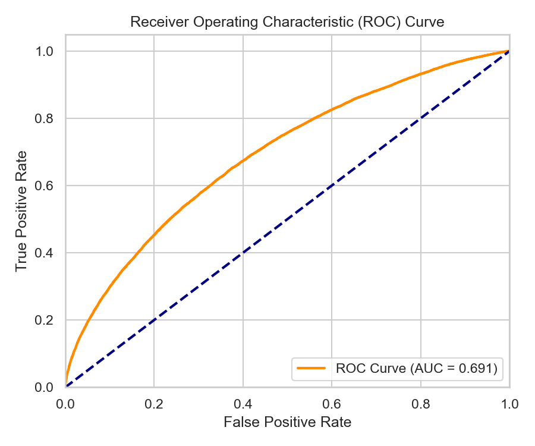
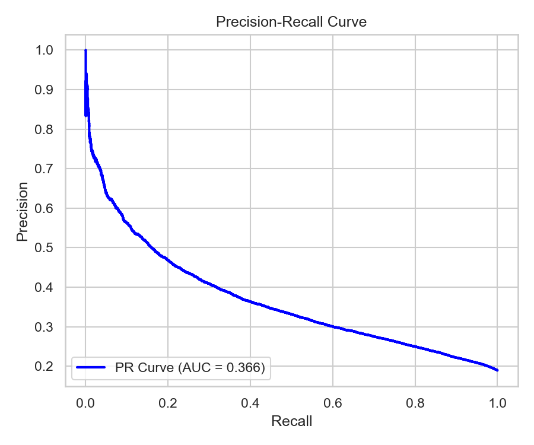

# ✈️ Airline Flight Delay & Cancellation Analytics Platform

[](https://www.python.org/downloads/)
[](http://localhost:8501)
[]()
[]()

An end-to-end data analytics, machine learning pipeline, and interactive executive reporting dashboard built to monitor airline operations, detect network bottlenecks, and predict pre-departure flight delays.

---

## 🗺️ System Architecture

The following flow represents the database ingestion, ML pipeline training, Excel/Power BI specification pipelines, and Streamlit frontend execution:



---

## 🌟 Interactive Features Showcase

Explore the key features of the platform by expanding the sections below:

<details>
<summary>📈 <b>1. Executive KPI Dashboard</b> (Click to Expand)</summary>
<br>

Presents core operational health metrics dynamically, including:
* **Total Flight Volume**
* **Average Departure & Arrival Delays** (in minutes)
* **On-Time Performance (OTP %)** (Target: >80%)
* **Flight Cancellation Rates** (Target: <2%)

*Includes dynamic interactive charts filtering flight statistics by carrier and departure slots.*
</details>

<details>
<summary>🔮 <b>2. ML Pre-Departure Delay Predictor</b> (Click to Expand)</summary>
<br>

A web form that estimates the probability of a flight being delayed by 15+ minutes based on scheduling inputs, airline carrier, historical performance, and weather variables.

### Feature Importances in the Model:
The plot below highlights what variables influence the flight delay classifier the most (e.g., historical carrier rates and scheduled departure time slots):


</details>

<details>
<summary>💻 <b>3. SQLite / MySQL Console</b> (Click to Expand)</summary>
<br>

A built-in custom SQL terminal that allows analysts and managers to write raw queries directly against the live database tables:
* Pre-written query templates (e.g., top delayed airports, carrier cancellation rates).
* Live-rendering pandas DataFrames of execution outputs.
* Fast exportable logs.
</details>

<details>
<summary>📊 <b>4. Excel Visual Dashboard</b> (Click to Expand)</summary>
<br>

Generates a fully-styled multi-sheet workbook at `excel/airline_analytics.xlsx` utilizing `openpyxl`.
* **Sheet 1 (Executive Summary):** Fully formatted KPI metrics and actual native Excel charts.
* **Sheet 2 (Pivot Analysis):** Grouped airline summaries.
* **Sheet 3 (Data Cleaning Log):** Traceable pipeline ingestion logs.
</details>

---

## 📂 Directory Structure

```
├── sql_database/
│      ├── schema.sql                 # MySQL-compatible database DDL
│      ├── import_data.py             # Python ETL & database ingestion script
│      └── airline_analytics.db       # SQLite local database (generated)
│
├── excel/
│      ├── generate_excel_dashboard.py# Automated Excel workbook generator
│      └── airline_analytics.xlsx     # Styled spreadsheet dashboard (generated)
│
├── python/
│      ├── feature_engineering.py     # Preprocessing & categorical encoding module
│      ├── train.py                   # Machine learning model training script
│      ├── evaluate.py                # Model evaluation and plot generator
│      ├── generate_historical_rates.py# Script computing delay rate target encodings
│      └── model/                     # Serialized models & metadata configurations
│
├── power_bi/
│      └── power_bi_specification.md  # Star-schema relationships & DAX specifications
│
├── github/
│      ├── README.md                  # Project overview and installation guide
│      ├── report.md                  # Comprehensive analyst operations report
│      ├── screenshots/               # Model curves and metrics plots (generated)
│      └── presentation.md            # Stakeholder slide deck outline
│
└── streamlit_app.py                  # Interactive Streamlit application (app entry point)
```

---

## 🚀 Quick Start Guide

Ensure you have Python 3.8+ installed. You can install all dependencies by running:

```bash
pip install pandas numpy scikit-learn openpyxl sqlalchemy streamlit altair matplotlib seaborn python-dotenv pymysql cryptography
```

### 1. Ingest Data (SQLite / MySQL)
Seeding the database creates a local SQLite database by default, or populates your centralized MySQL database if configured in `.env`.
```bash
python sql_database/import_data.py
```

### 2. Generate the Excel Dashboard
To generate the styled, multi-sheet workbook containing operational pivots and native Excel charts:
```bash
python excel/generate_excel_dashboard.py
```

### 3. Run the ML Pipeline (Train & Evaluate)
To fit the pre-departure delay model, compute historical target encodings, and generate evaluation plots:
```bash
python python/train.py
python python/generate_historical_rates.py
python python/evaluate.py
```

### 4. Launch the Streamlit App
To start the interactive executive dashboard:
```bash
python -m streamlit run streamlit_app.py
```
Open [http://localhost:8501](http://localhost:8501) in your browser.

---

## 📈 ML Model Performance Validation

The predictor utilizes a fast gradient-boosted tree model trained on **200,000 operations**. Below are the pipeline evaluation plots generated dynamically during `python/evaluate.py`:

| Confusion Matrix | ROC Curve |
| --- | --- |
|  |  |

| Precision-Recall Curve | Feature Importance |
| --- | --- |
|  |  |

---

## 🔒 Security & Privacy (Ignored Files)

This repository includes a pre-configured `.gitignore` file that ensures sensitive information and very large datasets are **never pushed to GitHub**:
* **`.env`:** Contains database passwords, hosts, and credentials.
* **`archive (5)/`:** Large CSV datasets (1.3GB training file) which would otherwise exceed GitHub's 100MB file limit.
* **`sql_database/airline_analytics.db`:** Local development database state.

---

## ☁️ How to Deploy on Streamlit Cloud

To deploy this interactive dashboard online for free:

1. Push your repository to **GitHub** (see Git command guide below).
2. Create a free account at [share.streamlit.io](https://share.streamlit.io/).
3. Connect your GitHub account, click **New App**, and specify your repository name and `streamlit_app.py` as the entry file.
4. **Environment Secrets:** If you are using MySQL, open **Advanced Settings** in Streamlit Cloud and configure your database connection string in the Secrets field:
   ```toml
   DATABASE_URL = "mysql+pymysql://<user>:<password>@<host>:3306/<database_name>"
   ```
5. Click **Deploy**!

---

## 🛠️ Linking to your GitHub Remote

To push this project to your GitHub account:

1. **Commit your modifications:**
   ```bash
   git add .
   git commit -m "Configure styling, fix Altair columns, and build interactive README"
   ```
2. **Rename default branch to main:**
   ```bash
   git branch -M main
   ```
3. **Add your remote GitHub repository:**
   ```bash
   git remote add origin https://github.com/YOUR_USERNAME/YOUR_REPO_NAME.git
   ```
4. **Push the code:**
   ```bash
   git push -u origin main
   ```
